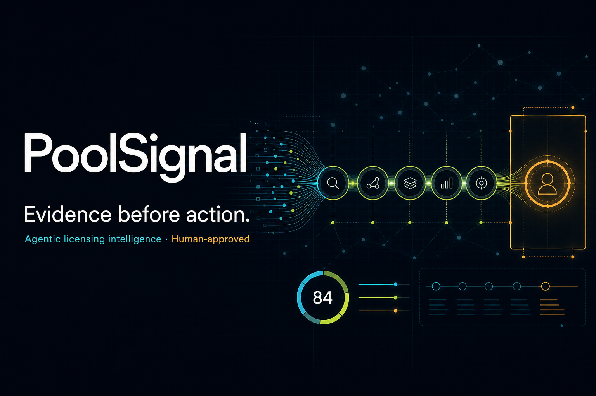

# PoolSignal



**Evidence-first, agentic Qi licensing intelligence with a human approval boundary.**

[**Open the live PoolSignal demo →**](https://poolsignal.ajaykasu7.workers.dev)

Production is deployed directly to Cloudflare Workers with a dedicated D1 database. The public demo does not depend on ChatGPT Sites or a developer laptop remaining online.

PoolSignal is a production-style portfolio project built for a licensing analytics role. It turns public product-certification signals, dated licensing-program snapshots, entity candidates, synthetic CRM activity, and explicit scenario assumptions into auditable human-review cases.

The central design choice is restraint: agents can find, normalize, compare, score, summarize, and recommend research. They cannot assert that a company is unlicensed, infer shipment volume from certification counts, contact a company, or advance an identity-sensitive case without a person.

## What the demo includes

- Polished intelligence console with mission control, agent trace, review queue, campaign flow, scenario lab, and data-quality views
- Six-agent Python pipeline with typed findings, evidence references, transparent scoring, abstention, policy-as-code, and SQLite audit persistence
- Cloudflare D1 schema and review-event API for durable human decisions
- PostgreSQL dimensional warehouse model and a Power BI-ready star-schema extract
- DAX measures for review volume, confidence, human-gate rate, aging, response rate, and data freshness
- Formula-driven Excel campaign review pack with validation, conditional formatting, source links, scenario controls, and QA checks
- Representative public records and clearly marked synthetic operations; no bulk scraper and no real outreach

## Agent fabric

| Agent | Responsibility | Guardrail |
|---|---|---|
| Data Quality | Validate source contract and quarantine anomalies | Invalid records do not reach other agents |
| Scout | Detect and classify new product signals | Uses observed source facts only |
| Resolver | Propose brand-to-legal-entity links | Abstains below 0.85 confidence |
| Coverage | Compare an approved entity with a dated public snapshot | Returns match state, never product coverage |
| Prioritizer | Produce an additive, feature-auditable review priority | Separate from entity confidence |
| Briefing | Generate a concise evidence-grounded analyst brief | Forbidden-claim validator and evidence references |
| Policy Gate | Control stage transitions and allowed actions | Identity-sensitive actions require a human |

See [architecture](docs/ARCHITECTURE.md), [model card](docs/MODEL_CARD.md), and [data-source boundaries](docs/DATA_SOURCES.md).

## Run locally

Requirements: Node.js 22.13+ and Python 3.11+.

```bash
npm install
npm run dev
```

The local portfolio opens at `http://localhost:3000`.

Run the agentic reference pipeline:

```bash
cd pipeline
python3 -m poolsignal.cli data/demo_signal.json --database poolsignal.db
python3 -m unittest discover -s tests -v
```

Build and verify the site:

```bash
npm test
```

Deploy the verified build to Cloudflare Workers:

```bash
npx wrangler d1 migrations apply poolsignal-db --remote
npm run deploy:cloudflare
```

The committed `wrangler.jsonc` binds the Worker to the production `DB` database. Authenticate once with `npx wrangler login` before the first deployment.

Generate D1 migrations after schema changes:

```bash
npm run db:generate
```

## Analytical artifacts

- `artifacts/PoolSignal_Campaign_Review_Pack.xlsx` — operational Excel workbook
- `powerbi/data/` — Power BI-ready dimensional extracts
- `powerbi/measures.dax` — suggested semantic-model measures
- `warehouse/schema.sql` — PostgreSQL analytical warehouse
- `drizzle/` — D1 application-state migration

## Eight-minute interview demonstration

1. Show a newly detected certification signal.
2. Explain why the Resolver abstained on an ambiguous brand.
3. Open the evidence packet and agent trace.
4. Show that public-list absence is labeled as a research condition, not licensing status.
5. Approve, monitor, or return the entity proposal and explain the audit event.
6. Move to the synthetic campaign flow and identify an aging item.
7. Adjust annual units in the scenario lab and explain every assumption.
8. Open the data-quality view and discuss precision, abstention, and schema drift.

The complete talk track is in [docs/DEMO_SCRIPT.md](docs/DEMO_SCRIPT.md).

## Security and governance

- Public and synthetic data only
- No contacts, notices, responses, or external messages
- Source snapshots are designed to be immutable and checksummed
- Retrieval must honor source terms, robots policies, caching, and rate limits
- No API secrets in the repository
- Human decisions are append-only review events
- Model output is advisory and constrained by policy-as-code

The dependency audit currently reports a transitive PostCSS advisory inside the starter-pinned Next.js dependency. The available automated fix proposes a breaking downgrade, so it is documented rather than applied blindly. See [SECURITY.md](SECURITY.md).

## Source context

- WPC certified-product database: https://jpsapi.wirelesspowerconsortium.com/products/qi
- Via Qi program: https://www.via-la.com/licensing-programs/qi-wireless-power/
- GLEIF entity API: https://www.gleif.org/en/lei-data/gleif-api/

This is an independent portfolio demonstration and is not affiliated with, endorsed by, or a statement on behalf of Via Licensing Alliance, Dolby Laboratories, or the Wireless Power Consortium.
