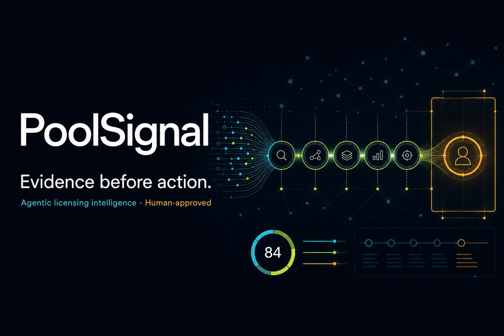

# PoolSignal



**Evidence-first, agentic Qi licensing intelligence with a human approval boundary.**

[**Open the live PoolSignal demo →**](https://poolsignal.ajaykasu7.workers.dev)

Production is deployed directly to Cloudflare Workers with a dedicated D1 database. The public demo does not depend on ChatGPT Sites or a developer laptop remaining online.

PoolSignal is a production-style portfolio project built for a licensing analytics role. It turns live public product-certification signals, dated licensing-program snapshots, entity candidates, synthetic CRM activity, and explicit scenario assumptions into auditable human-review cases. The live feeds require no API key, account, or email registration.

The central design choice is restraint: agents can find, normalize, compare, score, summarize, and recommend research. They cannot assert that a company is unlicensed, infer shipment volume from certification counts, contact a company, or advance an identity-sensitive case without a person.

## What the demo includes

- Polished intelligence console with mission control, a durable source-change inbox, agent trace, review queue, campaign flow, scenario lab, and data-quality views
- Scheduled WPC Qi monitoring every six hours, a daily Via public-list snapshot, and cached on-demand GLEIF entity enrichment
- Per-product SHA-256 fingerprints, material-field diffs, idempotent event keys, automatic agent processing, bounded retries, and a dead-letter state
- Live five-agent Worker pipeline with persisted versioned runs plus a six-agent Python reference pipeline, both with typed findings, transparent scoring, abstention, and policy-as-code
- Cloudflare D1 review-event API with server-derived case data, strict validation, and authenticated reviewer writes
- Functional evidence search, queue sorting, server-verified agent runs, and clearly labeled local decision previews
- PostgreSQL dimensional warehouse model and a Power BI-ready star-schema extract
- DAX measures for review volume, confidence, human-gate rate, aging, response rate, and data freshness
- Formula-driven Excel campaign review pack with validation, conditional formatting, source links, scenario controls, and QA checks
- Live bounded public-source monitoring plus clearly marked synthetic operations; no real outreach

## Agent fabric

| Agent | Responsibility | Guardrail |
|---|---|---|
| Data Quality | Validate source contract and quarantine anomalies | Invalid records do not reach other agents |
| Scout | Detect and classify new product signals | Uses observed source facts only |
| Resolver | Propose brand-to-legal-entity links | Abstains below 0.85 confidence |
| Coverage | Compare an approved entity with a dated public snapshot | Returns match state, never product coverage |
| Prioritizer | Produce an additive, feature-auditable review priority | Separate from entity confidence |
| Briefing | Generate a concise evidence-grounded analyst brief | Forbidden-claim validator and evidence references |
| Policy Gate | Control stage transitions and allowed actions | Identity-sensitive actions require a human |

See [architecture](docs/ARCHITECTURE.md), [model card](docs/MODEL_CARD.md), and [data-source boundaries](docs/DATA_SOURCES.md).

## Run locally

Requirements: Node.js 22.13+ and Python 3.11+.

```bash
npm install
npm run dev
```

The local portfolio opens at `http://localhost:3000`.

Authenticated review writes are optional. Copy `.dev.vars.example` to `.dev.vars`, replace the placeholder with a long random `REVIEWER_TOKEN`, and enter that same value in the review queue. Without a key, decision buttons remain safe, explicitly local previews.

No source credential is needed for WPC, Via, or GLEIF. WPC is refreshed by the Worker, Via by a scheduled portability workflow, and GLEIF only when a durable WPC change event invokes the Resolver. On a new deployment, apply the migrations and run one authenticated `POST /api/live-data` WPC refresh (or wait for its schedule). The first snapshot establishes a fingerprint baseline without generating fake events. The Via publisher uses a short-lived GitHub OIDC identity bound to this repository, workflow, and `main` branch—there is no stored ingestion secret.

Run the agentic reference pipeline:

```bash
cd pipeline
python3 -m poolsignal.cli data/demo_signal.json --database poolsignal.db
python3 -m unittest discover -s tests -v
```

Build and verify the site:

```bash
npm test
```

Deploy the verified build to Cloudflare Workers:

```bash
npx wrangler d1 migrations apply poolsignal-db --remote
npm run deploy:cloudflare
```

The committed `wrangler.jsonc` binds the Worker to the production `DB` database. Authenticate once with `npx wrangler login` before the first deployment.

Inspect the applied D1 migrations:

```bash
npm run db:migrations
```

## Analytical artifacts

- `artifacts/PoolSignal_Campaign_Review_Pack.xlsx` — operational Excel workbook
- `powerbi/data/` — Power BI-ready dimensional extracts
- `powerbi/measures.dax` — suggested semantic-model measures
- `warehouse/schema.sql` — PostgreSQL analytical warehouse
- `drizzle/` — D1 application-state migration

## Eight-minute interview demonstration

1. Show the source monitor, 500-product fingerprint baseline, and disabled “No new source changes” control.
2. Open the Change Inbox and explain material-field diffs, idempotency, version binding, retries, and dead-letter handling.
3. Explain why the Resolver abstained on an ambiguous brand and open the evidence-to-decision trace.
4. Show that public-list absence is labeled as a research condition, not licensing status.
5. Approve, monitor, or return the entity proposal and explain the audit event.
6. Move to the synthetic campaign flow and identify an aging item.
7. Adjust annual units in the scenario lab and explain every assumption.
8. Open the data-quality view and discuss precision, abstention, and schema drift.

The complete talk track is in [docs/DEMO_SCRIPT.md](docs/DEMO_SCRIPT.md).

## Security and governance

- Public and synthetic data only
- No contacts, notices, responses, or external messages
- Source snapshots are append-only and checksummed; conformed records retain first- and last-seen timestamps
- Material product fields receive per-record SHA-256 fingerprints; unchanged snapshots create no agent work
- Change events and live agent results are durable, idempotent, version-bound, retryable, and auditable
- Retrieval must honor source terms, robots policies, caching, and rate limits
- No API secrets in the repository
- Direct public live reruns are disabled; scheduled change events invoke persisted live runs and never perform outreach
- Durable human decisions require an environment-managed reviewer secret and create append-only review events
- HTTPS redirection, CSP, HSTS, clickjacking protection, restrictive permissions policy, and content-type hardening
- Model output is advisory and constrained by policy-as-code

Both the full dependency audit and the production-only dependency audit report zero known vulnerabilities. See [SECURITY.md](SECURITY.md).

## Source context

- WPC certified-product database: https://jpsapi.wirelesspowerconsortium.com/products/qi
- Via Qi program: https://www.via-la.com/licensing-programs/qi-wireless-power/
- GLEIF entity API: https://www.gleif.org/en/lei-data/gleif-api/

This is an independent portfolio demonstration and is not affiliated with, endorsed by, or a statement on behalf of Via Licensing Alliance, Dolby Laboratories, or the Wireless Power Consortium.
